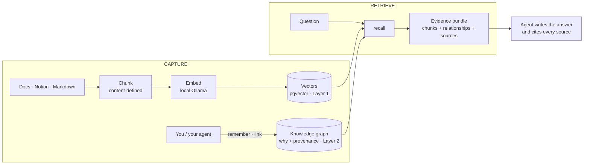

# 🧠 Brainiac

**A self-hosted, long-term memory for you and your AI agents.**
It remembers not just *what* exists, but **why it is that way** — the decisions, the
trade-offs, the rejected alternatives, and who decided when.

[](https://github.com/programmism/brainiac/tags)
[](https://go.dev)
[](LICENSE)
[](#faq)

Brainiac combines two things in one small Postgres-backed service:

- **Semantic search** over your notes, docs, and pages (RAG) — powered by **local**
  Ollama embeddings, so nothing leaves your machine.
- **A curated knowledge graph** where every relationship carries a **`why`**, its
  **provenance**, and its **author** — the part that turns a pile of facts into a
  memory of *decisions*.

It's designed to be an agent's memory: connect it over **MCP** and your agent
(Claude, Cursor, Cline, or your own) recalls before it answers and saves what you
learn — automatically, across every session.

> 💡 **No cloud LLM. No extraction LLM. No GPU.** The only model it runs is a small
> local embedder. It fits on a 4 GB box and one `docker compose up`.

---

## How it works

Brainiac is a **retrieval engine with a curated graph** — it *retrieves* evidence;
your agent does the *reasoning*. That's "RAG without the G on our side."



**Two layers, one Postgres:**

| Layer | What | Built by | Used for |
|------|------|----------|----------|
| **1 · Semantic search** | text chunks + embedding vectors | automatic pipeline (chunk → embed → store) | "find things about X" |
| **2 · Knowledge graph** | entities (nodes) + relationships (edges) with `why`/provenance/author | **you or your agent**, via `remember`/`link` — *not* an extraction LLM | "*why* is X like this / what depends on it" |

When you **`recall`**, Brainiac blends both — nearest chunks *plus* the relevant
graph and the raw evidence behind it — and hands your agent a cited evidence bundle.
Brainiac never writes prose; it retrieves, the agent synthesizes.

---

## Capabilities

- 🔎 **Semantic search** over a curated corpus (pgvector + HNSW, local embeddings).
- 🕸️ **Knowledge graph** — every edge records the rationale, source, and author.
- 💬 **Chat-driven capture** — tell your agent "save this" and it lands with its links.
- 🔌 **MCP server** — plug into any MCP agent; tools: `search`, `recall`, `remember`,
  `link`, `disambiguate`, `supersede`, `add_document`, `ingest`.
- 🗂️ **Multi-project memory** — one instance, many projects; same-named entities stay
  distinct, recall focuses on the project you're in. See [multi-project](#multi-project-memory).
- 📥 **Connectors** — Markdown folders (auto-imported) and Notion, sharing one corpus.
- ♻️ **Self-healing ingest** — content-defined chunking; editing a doc re-embeds only
  the touched region, not the whole tail. Deleting a source keeps its memory.
- 🧹 **Librarian pass** — proposes duplicate **merges** and conflated-node **splits**;
  flags stale/contradictory facts. You approve; nothing is auto-applied.
- 🖥️ **WebUI** — Search / Recall / Graph / Consolidation queue / Health / System.
- 📈 **Operable** — `/healthz`, `/readyz`, Prometheus `/metrics`, a System panel, and a
  CI smoke test that boots the whole stack and asserts readiness.
- 🔒 **Private & self-hosted** — no data leaves your box; secure-by-default binding.

---

## Quick start

```bash
git clone https://github.com/programmism/brainiac && cd brainiac
cp .env.example .env          # sane defaults; set your secrets
docker compose up             # db (pgvector) + ollama + app; migrations & model pulled automatically
```

That's the hard requirement: **one command → a healthy stack**, even on a 4 GB box.
Open the WebUI at **http://localhost:8080** and check `curl -s localhost:8080/readyz`.

### On your laptop (no Go, no exposed ports)

```bash
./brainiac up
./brainiac logs ollama-pull            # wait for the model to download once
# drop Markdown into ./data/docs — auto-imported within a minute
./brainiac search "why kafka"
./brainiac recall "why is X built this way"
```

Full guide: **[docs/laptop.md](docs/laptop.md)**.

### Make it your agent's memory

```bash
./brainiac mcp-config        # prints the MCP server config to paste into your agent
./brainiac instructions      # prints the memory instruction to add to its rules
```

Connect any MCP agent (Claude Desktop/Code, Cursor, Cline, or a custom SDK), add the
instruction, and it will recall before answering and save findings on its own.
Full guide: **[docs/agent-memory.md](docs/agent-memory.md)**.

### Updating

The `app` service is **built from this checkout**, so updating is: get the new code, then rebuild.

```bash
git pull                       # latest main — or `git fetch --tags && git checkout v1.17.0` to pin a release
docker compose up -d --build   # rebuilds & recreates app; only what changed is touched
```

- **Migrations apply automatically** on boot (idempotent) — no manual step.
- **Your data is safe:** the corpus and models live in the `pgdata` / `ollama` named volumes;
  a rebuild never touches them (only `docker compose down -v` deletes volumes).
- **Verify:** `curl -s localhost:8080/readyz`, then check the WebUI **System** tab (or `GET /api/system`).
- **Roll back** the same way: `git checkout <previous tag> && docker compose up -d --build`.
- The MCP server runs *inside* `app`, so recreating it briefly drops the MCP connection — your agent
  reconnects on its next call.

---

## What it's for — and what it isn't

**✅ Great fit**

- A **personal or team knowledge base** that keeps the *why*: architecture decisions,
  trade-offs, "why we chose A over B", who/when.
- **Long-term memory for AI agents** — shared, cited, growing across sessions.
- **Multi-project** engineering memory on a single small server.
- A **private** RAG over your own notes/docs, with no cloud dependency.

**🚫 Not the right tool**

- **Not a chatbot / answer generator** — it returns evidence; your agent writes the answer.
- **Not an automatic knowledge extractor** — the graph is *curated* (by you/your agent),
  not mined from documents by an LLM. That's a feature: no hallucinated relationships.
- **Not a web-scale vector store** — it's tuned for a curated corpus on a small box, not
  hundreds of millions of documents (there's a scaling ladder, but that's not the target).
- **Not your source of truth / primary database** — it's a memory layer alongside them.
- **Not a place to dump-and-forget** — value comes from curating and the occasional
  librarian pass.

---

## FAQ

**Do I need a GPU, an API key, or a cloud LLM?**
No. The only model is a small local embedder (`nomic-embed-text` via Ollama). Runs CPU-only on ~4 GB RAM. Nothing is sent to any cloud.

**Does it use an LLM to build the knowledge graph?**
No. The graph is filled by explicit `remember`/`link` calls — your agent in chat, or you via the CLI. So every relationship is deliberate and carries a real `why`, instead of being auto-extracted (and possibly hallucinated).

**Which agents can use it?**
Any [MCP](https://modelcontextprotocol.io) client — Claude Desktop/Code, Cursor, Cline, VS Code, or your own SDK. It's an open protocol, not Claude-specific.

**Is my data private?**
Yes — fully self-hosted. Text, vectors, and graph live in your Postgres; embeddings are computed locally. The app binds to `127.0.0.1` and writes are off unless you explicitly enable them.

**Can I use it as plain RAG, without the graph?**
Yes. `add_document` + `search`/`recall` gives you semantic search on its own; the graph is an optional second layer.

**What happens when a source document changes or is deleted?**
Edits **reconcile** (only changed chunks re-embed, thanks to content-defined chunking). Deleting a source file **keeps** its imported memory — a memory persists even if the source is gone.

**How do I keep different projects from getting mixed up?**
Pass a `project` when saving/recalling: same-named entities in different projects stay distinct and recall focuses on your project + global facts. Need finer identity (e.g. prod vs staging)? Add an axis reactively with `disambiguate`/`split`. Need a hard wall? Run a separate stack. See [multi-project](#multi-project-memory).

**How big can it get?**
It's tuned for a curated corpus on a small box. If the archive outgrows pgvector there's an escalation ladder (selection → quantization → tiering → external cold store) — see [ADR 0003](docs/decisions/0003-cold-tier-at-scale.md).

**Windows?**
Use WSL, or run the underlying `docker compose` commands directly.

---

## Multi-project memory

One Brainiac serves many projects. Two things are deliberately separate:

- **Identity** — `Config` in project *alpha* and `Config` in *beta* are **distinct
  entities** that accrue their own facts and never get merged.
- **Visibility** — `recall`/`search` with a `project` return that project **+ global**;
  omit it to look across everything. It's a soft lens (nothing hidden), not a wall.

Introduce finer axes only when you actually see a conflation: `disambiguate` re-scopes a
whole entity (e.g. "this is the prod one"), and the librarian's **split** detector
proposes separating a node whose facts contradict. Need enforced isolation
(privacy/compliance)? Run a separate stack per team. Details:
**[docs/agent-memory.md](docs/agent-memory.md)**.

---

## Interfaces

New to the verbs? **[Concepts & Workflows](docs/concepts-and-workflows.md)** explains the mental model
and what each does / when to use it.

- **MCP tools:** `search` · `recall` · `remember` · `link` · `disambiguate` ·
  `supersede` · `add_document` · `ingest`
- **CLI (`kb` / `./brainiac`):** `search` · `recall` · `remember` · `link` ·
  `disambiguate` · `supersede` · `import` · `consolidate` · `merge` · `split` ·
  `retire-edge` · `reembed` · `health`
- **HTTP API:** `GET /api/{health,system,search,recall,graph,consolidate}`,
  `POST /api/{merge,split}` and edge confirm/flag-stale/retire (writes are auth-gated & off by default).

---

## Architecture

**Core + plugins + clients.** All business logic lives in one `core`; plugins
(connectors / extractors / selectors / embedders) keep it domain-neutral; the clients
(MCP, WebUI, CLI) are thin adapters that just call the core.

```
sources ──connectors──▶ core (chunk · select · embed · store · graph · recall · consolidate) ──▶ Postgres+pgvector
                          ▲
          MCP · WebUI · CLI  (thin clients — no logic of their own)
```

> 📖 **[SYSTEM.md](SYSTEM.md)** is the living spec — architecture, every technology
> decision *and its rationale*, the data model, and a dated decision log. Read it before
> contributing; update it in the same PR as any change.

**More docs:** [concepts & workflows](docs/concepts-and-workflows.md) · [laptop](docs/laptop.md) ·
[agent memory](docs/agent-memory.md) · [operations](docs/operations.md) · [deployment](docs/deployment.md) ·
[production readiness](docs/production-readiness.md) · [decision records](docs/decisions/).

## Stack

Go 1.25+ · Postgres 16 + pgvector · Ollama (`nomic-embed-text`) · net/http + chi · pgx ·
cobra · [MCP](https://modelcontextprotocol.io) · Docker Compose · Caddy.
See [SYSTEM.md §3](SYSTEM.md#3-technology-decisions-and-why) for the *why* behind each.

## Status

**Usable today.** Full core operation set, MCP + CLI + WebUI, connectors, the librarian
pass, multi-project memory, metrics, backups, and one-command deploy are all in place and
released (semver `v1.x`). Development continues as GitHub
[issues](https://github.com/programmism/brainiac/issues); see [SYSTEM.md](SYSTEM.md)'s
decision log for what changed and why.

## License

MIT — see [LICENSE](LICENSE).
